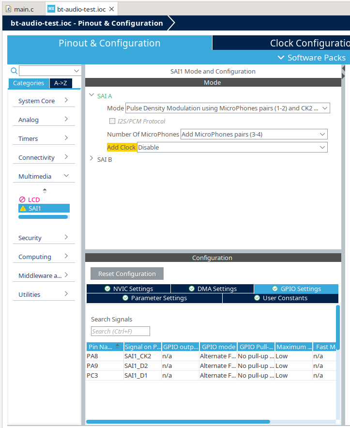

# Microphone setup

The part used is the ST IMP34DT05 and the datasheet is [here.](https://www.st.com/resource/en/datasheet/imp34dt05.pdf)

The microphone connections on the companion board are:

| Schematic Label| STM32WB5MMG Pin |
|---|---|
| PDM_CLK | PA8 |
| PDM_DI | PA9 |
| MIC_PWR | PC10 |
| | |

The STM32CubeMX settings are show below:

NOTE: The companion board microphone can only work if the IMU is NOT fitted as pin `PC3 - IMU_PWR` is allocated by STM32CubeIDE for the `SA1` interface.

## Driver software

We need to use DMA transfer to get the data.  I used the code I wrote for the serial comms receiver as inspiration although it worked in a different way to the microphone.
